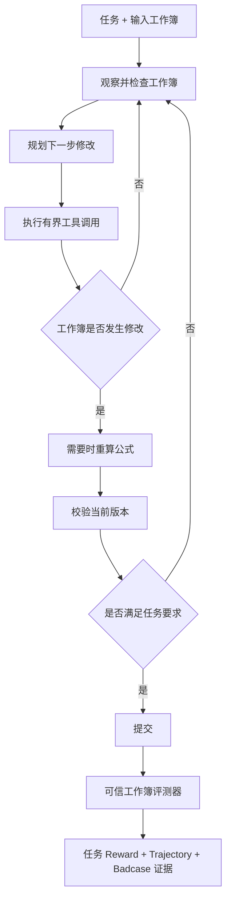

# Spreadsheet Work Agent

Spreadsheet Work Agent 将自然语言表格需求转化为经过验证的工作簿修改。它能够检查真实
工作簿、规划并执行多步工具调用、在需要时重算公式、校验当前文件版本，并将最终结果提交
给可信的工作簿评测器。

其中，模型本身是 **Spreadsheet Work Agent**；模型周围的运行时是
**Spreadsheet Agent Harness**。Harness 包含工具、事务边界、资源限制、校验协议、评测器
集成和诊断能力，使长程表格任务具备可训练、可评测和可排查的执行基础。

## 为什么需要 Agent Harness

电子表格任务不是一次文本生成。Agent 修改的是有状态的二进制文件：即使工具返回成功，
也可能写错 Sheet 或 Range、写入错误公式、丢失格式、产生陈旧公式值或损坏文件。因此，
可靠的 Spreadsheet Work Agent 需要具备以下能力：

- 检查真实工作簿，而不是根据 Prompt 猜测结构；
- 执行有界、可回滚的修改；
- 保留公式和工作簿结构；
- 区分“工具执行成功”和“任务完成正确”；
- 重算并检查公式派生值；
- 校验即将提交的准确文件版本；
- 在不改变可信 Reward 的前提下记录失败证据。

## Agent 工作流



核心循环是：**检查 → 修改 → 重算 → 校验 → 提交**。校验与工作簿版本绑定；校验后继续
修改会立即使旧校验失效，因此 Agent 无法校验一个版本后提交另一个版本。

## Spreadsheet Agent Harness 架构

```text
自然语言任务 + 工作簿
        |
        v
观察与结构化检查
预览 / list_sheets / inspect_range / find_cells
        |
        v
Work Agent 策略
        |
        v
有界动作路由
解析 / 投影 / 每轮最多 4 个调用 / 每轮计数型操作最多 100K 单元格
        |
        v
事务式工作簿工具
Python / 值 / 公式 / 格式 / 表结构
        |
        v
重算与校验门禁
LibreOffice / 公式检查 / 版本追踪
        |
        v
提交 + 官方评测器
        |
   +----+----+
   |         |
   v         v
GRPO 奖励    轨迹诊断
```

### 工作簿原生工具

`native_basic` 工具集提供结构化表格操作，同时保留 `run_python` 处理原生 API 尚未覆盖的
复杂任务。

| 阶段 | 工具 |
| --- | --- |
| 检查 | `list_sheets`、`inspect_range`、`find_cells` |
| 修改值和公式 | `write_range`、`clear_range`、`fill_formula` |
| 修改格式和结构 | `format_range`、`delete_rows`、`delete_columns`、`manage_sheet` |
| 重算 | `recalculate_and_read` |
| 兜底能力 | `run_python` |
| 完成任务 | `validate_workbook`、`submit` |

### 事务安全

- 每个 Episode 在独立的工作簿 Sandbox 中运行。
- Python 或原生修改失败时自动回滚，不保留半成品。
- 损坏的 `.xlsx` 在替换已提交工作簿前会被拒绝。
- 公式检查会发现非法公式和 `#REF!` 引用。
- `write_range`、`clear_range`、`fill_formula` 和 `format_range` 单次最多处理
  50,000 个单元格。
- 同一轮上述计数型操作累计最多尝试处理 100,000 个单元格，每轮最多接纳 4 个工具调用；
  Python 兜底和结构操作不计入 Cell Counter。
- 超量调用会被截断并反馈给 Agent，Agent 可在下一轮继续执行。
- 控制台日志不输出完整 Python 源码，Trajectory 仍保留动作以便诊断。

### 校验与 Reward

Harness 可以使用 Headless LibreOffice 重算临时工作簿副本，并读取指定范围的重算结果。
提交前必须成功校验当前工作簿版本。最终 Reward 仍来自官方评测器对答案位置的工作簿比较，
不会使用 Parser 合法性、工具成功率或 Badcase 标签替代任务结果。

### 训练可观测性

每条 Rollout 记录投影和实际执行的工具、错误与短路、校验和提交状态、工作簿得分及有界
诊断证据。失败任务可以分类为：写错 Sheet/Range、只完成部分要求、公式静态化、公式结果
错误、格式遗漏，以及“工具执行无错误但工作簿得分为 0”等。标签只用于解释失败，不会
隐式改变成功定义。

## 快速开始

以下命令均从仓库根目录执行。路径是占位符；凭据只应保存在 Shell 环境中，不得提交。

### 1. 检查运行环境

```bash
python -c 'import openpyxl, pandas, ray; print("Python dependencies: ok")'
command -v libreoffice || command -v soffice
test -f /path/to/Spreadsheet-RL/train_hermes.parquet
test -f /path/to/Spreadsheet-RL/test_verified_hermes.parquet
```

两个 Parquet 文件及其引用的工作簿应位于同一个数据根目录。后续 Loader Scale Smoke 会
通过真实训练适配器验证这些引用，无需远程模型 API 凭据或其他研究流程的数据集。

### 2. 启动外部 Ray 集群

```bash
NNODES=2 N_GPUS_PER_NODE=8 GPUS_PER_NODE=8 \
  bash rl/scripts/mpi_ray_up.sh

source runs/ray/ray_address.env
RAY_ADDRESS="$RAY_ADDRESS" ray status

SPREADSHEET_RL_DATA_ROOT=/path/to/Spreadsheet-RL \
SPREADSHEET_RL_TRAIN_FILE=train_hermes.parquet \
SPREADSHEETBENCH_ACTOR_TIMEOUT_SECONDS=180 \
PYTHONPATH=.:rl:third_party/verl-agent \
  python rl/scripts/smoke_spreadsheetbench_loader_scale.py
```

### 3. 训练 Work Agent

```bash
MODEL=/path/to/Qwen3-4B-Thinking-2507 \
MODE=diagnostic \
NNODES=2 N_GPUS_PER_NODE=8 GPUS_PER_NODE=8 TP=2 \
TRAIN_BS=16 PPO_MINI_BS=16 GROUP_N=8 \
VAL_SIZE=399 VAL_CONCURRENCY=64 \
TOTAL_TRAINING_STEPS=100 TEST_FREQ=20 SAVE_FREQ=20 \
MAX_STEPS=10 MAX_PROMPT_LENGTH=8192 MAX_RESPONSE_LENGTH=16384 \
SPREADSHEETBENCH_DATA_FORMAT=spreadsheet_rl \
SPREADSHEET_RL_DATA_ROOT=/path/to/Spreadsheet-RL \
SPREADSHEET_RL_TRAIN_FILE=train_hermes.parquet \
SPREADSHEET_RL_VAL_FILE=test_verified_hermes.parquet \
SPREADSHEETBENCH_TOOL_SET=native_basic \
SPREADSHEETBENCH_HISTORY_MODE=compact \
SPREADSHEETBENCH_REQUIRE_VALIDATION_BEFORE_SUBMIT=true \
SPREADSHEETBENCH_BADCASE_DIAGNOSTICS=full \
SPREADSHEETBENCH_MAX_RECALC_CALLS=1 \
SPREADSHEETBENCH_RECALC_TIMEOUT_SECONDS=120 \
SPREADSHEETBENCH_TRAIN_SHUFFLE_SEED=0 \
SPREADSHEETBENCH_LOG_LEVEL=error \
ACTOR_LR=3e-7 KL_LOSS_COEF=0.005 \
USE_INVALID_ACTION_PENALTY=True INVALID_ACTION_PENALTY_COEF=0.1 \
WANDB_MODE=offline \
bash rl/scripts/submit_spreadsheetbench_grpo.sh
```

### 4. 在全部 399 条任务上评测 Base 和 Checkpoint

训练仍在运行时，只能在第二个调度资源分配中执行以下启动命令，该分配中的
`/etc/mpi/hostfile` 必须指向不同的物理节点。仅修改状态文件名不能隔离 Ray；
`mpi_ray_up.sh` 会停止其目标节点上的现有 Ray。如果没有独立资源，应等待训练结束后复用
原集群。

```bash
TRAIN_RUN=/path/to/training-run
export CLUSTER_ID=full399
export RUN_ROOT="$PWD/runs/parallel_eval/$CLUSTER_ID"
export RAY_STATE_FILE="$PWD/runs/ray/ray_address_${CLUSTER_ID}.env"
export HOSTFILE="$PWD/runs/ray/hostfile_${CLUSTER_ID}"
export LOG_FILE="$PWD/runs/ray/ray_up_${CLUSTER_ID}.log"

NNODES=2 N_GPUS_PER_NODE=8 GPUS_PER_NODE=8 \
  RAY_STATE_FILE="$RAY_STATE_FILE" HOSTFILE="$HOSTFILE" LOG_FILE="$LOG_FILE" \
  bash rl/scripts/mpi_ray_up.sh
source "$RAY_STATE_FILE"

RAY_STATE_FILE="$RAY_STATE_FILE" \
RUN_ROOT="$RUN_ROOT" \
NNODES=2 N_GPUS_PER_NODE=8 GPUS_PER_NODE=8 TP=2 \
VAL_SIZE=399 VAL_CONCURRENCY=64 MAX_STEPS=10 \
MAX_PROMPT_LENGTH=8192 MAX_RESPONSE_LENGTH=16384 \
SPREADSHEET_RL_DATA_ROOT=/path/to/Spreadsheet-RL \
SPREADSHEET_RL_TRAIN_FILE=train_hermes.parquet \
SPREADSHEET_RL_VAL_FILE=test_verified_hermes.parquet \
SPREADSHEETBENCH_TOOL_SET=native_basic \
SPREADSHEETBENCH_HISTORY_MODE=compact \
SPREADSHEETBENCH_REQUIRE_VALIDATION_BEFORE_SUBMIT=true \
SPREADSHEETBENCH_BADCASE_DIAGNOSTICS=full \
SPREADSHEETBENCH_LOG_LEVEL=error \
WANDB_MODE=offline \
bash rl/scripts/submit_spreadsheetbench_eval.sh \
  base=/path/to/base-model \
  step100="$TRAIN_RUN/ckpts/global_step_100/actor/huggingface"
```

每个评测目录会生成逐任务 Trajectory、`badcases.jsonl` 和 `badcase_summary.json`。完整配置、
并行集群流程、对比命令和故障排查见 [Harness 操作手册](rl/README.md)。

## 当前实验结果

当前最强的完整 399 条评测来自一次启用确定性训练数据 Shuffle 的 NJ5 实验：

| 模型 | 工作簿成功数 | 成功率 | 测试得分 |
| --- | ---: | ---: | ---: |
| Base | 94/399 | 23.56% | 0.1573 |
| Step 100 | 119/399 | 29.82% | 0.1930 |

Step 100 相对 Base 净增加 25 个成功任务，Paired Exact McNemar Test 为
`p=0.005228`。`tool_error` 从 178 降至 100，疑似写错 Sheet/Range 的失败从 44 降至 29。

这是**单次训练结果**，尚不能视为已复现的稳定提升。Step 100 是在评测多个 Checkpoint 后
选出的最佳点；第二个训练 Seed 尚未验证该增益，Step 110 也回落到 `101/399`。公式结果
错误仅从 173 降到 169，而“执行无错误但得分为 0”的任务从 127 增加到 180。因此，当前
证据说明模型更熟练地遵守了工具协议，并在这次实验内显著提高成功率，但工作簿语义仍是
主要瓶颈。

详细结果见[实验记录](md/experiment_results_20260930.md)和
[Badcase 报告](md/rollout_badcase_report.md)。

## 当前限制与后续路线

1. **语义 Observation Projection：** 当前只提供有界预览；仍需根据任务语义选择相关
   Sheet、Range、表头和公式，并完成固定任务 A/B。
2. **公式语义：** 工具执行成功不代表公式表达了正确计算逻辑，公式结果错误是下一阶段的
   重点能力问题。
3. **实验溯源：** Run Manifest 仍需记录 Dirty Worktree、Diff Checksum、Dataset Hash、
   Task Fingerprint 以及 Prompt/Tool Version。
4. **重复实验：** Step 100 结果需要在相同 full-399 协议下使用第二个训练 Seed 复现。
5. **Checkpoint 选择：** 后期训练可能退化，应使用预先声明的选择规则或 Early Stopping，
   而不是盲目延长训练。

最新完成状态及历史计划归档见
[Spreadsheet Work Agent 当前实现状态](md/spreadsheet_work_agent_status.md)。

## 仓库结构

| 路径 | 职责 |
| --- | --- |
| `envharness/bridges/spreadsheetbench/` | 工作簿环境、工具、校验、评测和诊断 |
| `rl/envharness_rl/spreadsheetbench/` | verl-agent Manager、Ray Worker、动作投影和 Rollout Summary |
| `rl/scripts/` | 训练、评测、对比、Smoke Test 和集群启动脚本 |
| `rl/tests/` | Harness 与集成回归测试 |
| `md/` | 实验结果、Badcase 分析、设计说明和实现状态 |
