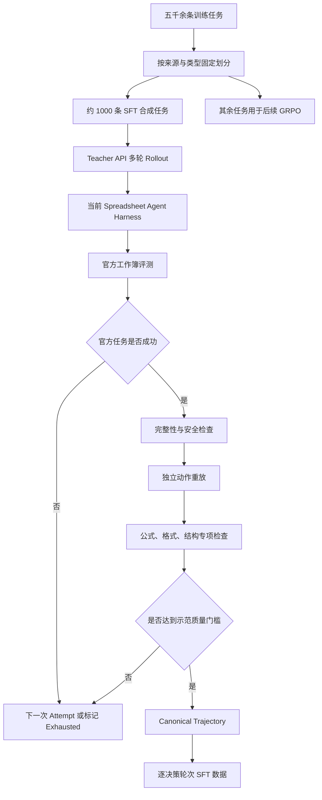

# Spreadsheet Work Agent：SFT 数据合成 Pipeline 设计

**状态：** 前五部分已确认，后续训练与实验设计待补充  
**更新时间：** 2026-10-10

## 0. 目标与已确认约束

本方案在当前 Spreadsheet Agent Harness 和纯 GRPO 实验基础上，引入外部 Teacher Model，
为 Spreadsheet Work Agent 合成可验证、可重放、与当前推理协议一致的 SFT 数据。

已确认约束：

- Teacher 通过 OpenAI-compatible API 接入；
- 第一阶段采用“Teacher 在真实 Harness 中交互采样”方案；
- 从五千余条训练任务中分层选择约 1,000 条作为 SFT 合成池；
- SFT 合成池与后续 GRPO 任务池严格按任务来源隔离；
- 每个任务最多进行 4 次有效 Teacher Rollout，获得合格成功轨迹后停止；
- fixed-399 SpreadsheetBench 评测集不参与轨迹生成、过滤规则开发或训练；
- Teacher 使用与当前 Agent 相同的 `native_basic` 工具和安全约束；
- Teacher 不能访问 Golden Workbook、标准答案值或评测差异；
- 当前文档覆盖数据合成的前五部分，不包含 SFT 超参数、Checkpoint 选择和最终对照实验设计。

---

## 1. 总体架构

### 1.1 核心思路

从运行机制看，数据合成相当于将当前评测流程中的 Policy Model 替换为能力更强的外部
Teacher Model，让 Teacher 在同一个 Spreadsheet Agent Harness 中执行任务：

```text
Spreadsheet-RL 训练任务
        ↓
Teacher API
        ↓
当前 Agent Prompt + native_basic 工具
        ↓
Spreadsheet Agent Harness
        ↓
真实工作簿状态变化
        ↓
LibreOffice 重算 + 官方评测
        ↓
成功轨迹过滤、重放与质量检查
        ↓
与当前推理 Prompt 对齐的 SFT 数据
```

Teacher 运行与普通评测的区别如下：

| 普通评测 | SFT 数据合成 |
| --- | --- |
| 在 fixed-399 上衡量模型能力 | 在独立的 1,000 条训练任务上生成示范 |
| 通常每个任务执行一次 | 每个任务最多执行 4 次 |
| 通常使用确定性解码 | 使用有界采样提高获得成功轨迹的概率 |
| 重点保存结果和诊断指标 | 必须保存完整 Prompt、动作和工具结果 |
| 成功与失败均进入统计 | 只有通过质量门禁的成功轨迹进入 SFT |
| 所有任务完成后结束 | 某任务获得合格轨迹后立即停止该任务的采样 |

### 1.2 端到端数据流



### 1.3 Teacher 可见信息边界

Teacher 只能看到当前 Agent 正常可见的信息：

- 自然语言任务；
- 当前工作簿观察；
- 工具定义和安全约束；
- 当前轨迹历史；
- 工具执行结果；
- 当前 Harness 已经向 Policy 暴露的任务元数据。

Teacher 不能看到：

- Golden Workbook 文件或路径；
- 标准答案单元格值；
- 官方评测器产生的逐单元格差异；
- 上一次失败 Attempt 与 Golden 的比较结果；
- 其他训练任务的隐藏答案。

官方评测只能在 Attempt 结束后用于筛选，不能把隐藏差异反馈给同一次或下一次 Teacher
Rollout。

---

## 2. 任务划分与 Teacher Rollout 调度

### 2.1 固定数据划分

首先生成不可变的任务划分 Manifest，而不是每次运行临时随机抽样：

```json
{
  "version": 1,
  "split_seed": 20261010,
  "source_dataset": "train_hermes.parquet",
  "source_dataset_hash": "...",
  "sft_train_task_ids": ["..."],
  "sft_dev_task_ids": ["..."],
  "rl_task_ids": ["..."],
  "excluded_eval_task_ids": ["..."]
}
```

总体划分为：

```text
约 5000 条 Spreadsheet-RL 训练任务
        ├── SFT 合成池：约 1000 条
        │     ├── SFT Train 候选：约 900 条
        │     └── SFT Dev 候选：约 100 条
        └── GRPO 任务池：其余约 4000 条

fixed-399：始终独立，只用于最终评测
```

### 2.2 泄漏与重复检查

划分不能只比较 Task ID，还必须检查：

- SFT、GRPO 和 fixed-399 是否存在相同 Task ID；
- 是否指向同一个输入工作簿；
- 是否具有相同 Workbook Hash；
- 是否来自同一个原始 Thread 或 Workbook Family；
- 是否只是文件名不同、内容相同的重复样本。

同一来源组必须整体进入同一个 Split：

```text
同一个原始 Thread / Workbook Family
→ 只能属于 SFT、GRPO 或 fixed-399 中的一侧
```

### 2.3 分层抽样

约 1,000 条 SFT 候选任务按以下维度分层抽取。

#### 任务类型

- 公式与函数；
- 数据写入与清洗；
- 查找与匹配；
- 聚合与统计；
- Sheet 或表结构操作；
- 格式设置；
- 多步骤混合任务。

#### 答案位置复杂度

- 单个单元格；
- 连续 Range；
- 多个不连续 Range；
- 跨 Sheet；
- 多 Sheet。

#### 工作簿复杂度

- Sheet 数量；
- 非空单元格数量；
- 公式单元格数量；
- 最大已使用 Range；
- 是否包含合并单元格；
- 是否存在隐藏 Sheet；
- 是否存在跨 Sheet 引用。

#### Base 难度

可以在候选任务上运行一次当前 Base，仅使用结果做难度分层，不把结果反馈给 Teacher：

- Base 已成功；
- 工具错误；
- 未提交；
- 公式静态化；
- 疑似写错 Sheet/Range；
- 工具执行干净但任务失败。

首轮建议任务组成：

```text
约 30%：Base 能完成的相对简单任务
约 40%：工具协议或 Sheet/Range 定位失败任务
约 30%：公式语义、多步骤等困难任务
```

最终比例应以完整训练集分布为基础，不机械追求上述近似值。

### 2.4 每任务最多四次独立 Rollout

每次 Attempt 必须从原始工作簿的全新副本开始：

```text
Task A
 ├── Attempt 1：全新工作簿副本
 ├── Attempt 2：全新工作簿副本
 ├── Attempt 3：全新工作簿副本
 └── Attempt 4：全新工作簿副本
```

禁止在下一次 Attempt 中继承上一次失败后的工作簿状态。

建议采样参数：

| Attempt | 建议 Temperature | 目的 |
| ---: | ---: | --- |
| 1 | 0.1 | 获得 Teacher 最稳定的标准解法 |
| 2 | 0.3 | 轻微探索不同策略 |
| 3 | 0.5 | 尝试不同工具或公式路线 |
| 4 | 0.7 | 最后一次扩大策略多样性 |

具体数值可以根据 Teacher API 特性调整，但四次 Attempt 使用相同的 System Prompt、工具
Schema、最大步数和 Harness 约束。Teacher 不会看到前一次 Attempt 的官方差异。

### 2.5 成功停止条件

不能只根据 `won=True` 停止，而应满足：

```text
official workbook success
AND trajectory quality pass
→ ACCEPTED 并停止该任务采样
```

如果官方成功但轨迹未达到示范质量门槛，则继续下一次 Attempt。

状态机为：

```text
PENDING
  ↓
RUNNING_ATTEMPT_1
  ├── 合格成功 → ACCEPTED
  └── 未通过 → RUNNING_ATTEMPT_2
                    ├── 合格成功 → ACCEPTED
                    └── 未通过 → RUNNING_ATTEMPT_3
                                      ├── 合格成功 → ACCEPTED
                                      └── 未通过 → RUNNING_ATTEMPT_4
                                                        ├── 合格成功 → ACCEPTED
                                                        └── 未通过 → EXHAUSTED
```

Teacher API 超时、Ray Actor 异常、网络错误或 LibreOffice 临时失败等基础设施错误不消耗
四次策略 Attempt 预算。只有完成有效 Rollout 并得到正常官方评测结果时，才计为一次
Attempt。

### 2.6 并发、成本与恢复基础要求

- 初始并发从 16 或 32 个任务开始；
- API 限流时指数退避；
- 每个 Task/Attempt 独立、原子地保存；
- 中断后从 Manifest 恢复；
- 已 `ACCEPTED` 的任务不重复采样；
- `EXHAUSTED` 任务单独记录，后续可以显式重开；
- Token、延迟和费用按 Task/Attempt 统计。

建议目录：

```text
runs/sft_synthesis/<run_id>/
├── manifest.json
├── split_manifest.json
├── attempts/
│   └── <task_id>/
│       ├── attempt_01.json
│       ├── attempt_02.json
│       └── accepted.json
├── workbooks/
│   └── <task_id>/<attempt_id>/
├── synthesis_summary.json
└── exhausted_tasks.jsonl
```

---

## 3. 轨迹 Schema 与 SFT 数据转换

### 3.1 Canonical Trajectory 是唯一事实来源

Teacher 产生多轮交互轨迹，但当前 Spreadsheet GRPO 并非使用标准的多轮 Chat Messages。
`SpreadsheetBenchEnvironmentManager.build_text_obs()` 会把工具说明、历史观察、历史动作和
当前观察拼成一个当前轮 Prompt。

因此第一版采用：

```text
原始层：完整保存多轮 Canonical Trajectory
训练层：拆分为逐决策轮次的 prompt-response 样本
```

这样能与当前 GRPO 推理输入保持一致。未来如果 Manager 切换为真正的 Chat History，可以
从同一份 Canonical Trajectory 重新导出 `messages` 数据，无需再次调用 Teacher。

### 3.2 Attempt 级 Schema

```json
{
  "schema_version": 1,
  "run_id": "teacher_synthesis_20261010",
  "trajectory_id": "...",
  "task": {
    "task_id": "...",
    "split": "sft_train",
    "instruction_type": "Formulas/Functions",
    "input_workbook_hash": "...",
    "task_source_group": "...",
    "answer_position": "'Sheet1'!K2:K100"
  },
  "teacher": {
    "provider": "openai_compatible",
    "model": "teacher-model-name",
    "model_revision": "...",
    "temperature": 0.1,
    "max_tokens": 16384
  },
  "runtime": {
    "git_commit": "...",
    "dirty_diff_hash": "...",
    "prompt_version": "...",
    "tool_schema_version": "...",
    "tool_set": "native_basic",
    "history_mode": "compact",
    "max_steps": 10
  },
  "steps": [],
  "final_result": {},
  "usage": {}
}
```

不得保存 API Key、Authorization Header 或内部服务凭据。

### 3.3 Step 级 Schema

```json
{
  "step": 1,
  "policy_prompt": "Teacher 本轮实际看到的完整字符串",
  "teacher_raw_response": "...",
  "teacher_visible_response": "...",
  "normalized_model_output": "<tool_call>...</tool_call>",
  "projected_actions": [
    {
      "name": "inspect_range",
      "arguments": {
        "sheet_name": "Sheet1",
        "range": "A1:K20",
        "mode": "cells"
      }
    }
  ],
  "tool_results": [],
  "next_observation": "...",
  "action_valid": true,
  "workbook_revision_before": 0,
  "workbook_revision_after": 0,
  "workbook_hash_before": "...",
  "workbook_hash_after": "...",
  "done": false,
  "latency_ms": 1234,
  "input_tokens": 5000,
  "output_tokens": 300
}
```

关键要求：

- `policy_prompt` 必须是 Teacher 真正看到的内容，不能事后近似重建；
- `teacher_raw_response` 用于审计原始 API 返回；
- `teacher_visible_response` 只包含 Agent 可见内容；
- `normalized_model_output` 是实际送入 Projection 的内容；
- `projected_actions` 保存解析后的动作；
- `tool_results` 和 `next_observation` 保存真实环境反馈；
- Revision 和 Hash 用于发现未记录的工作簿修改。

### 3.4 隐藏推理处理

- 不将 Teacher API 的隐藏 Reasoning 放入 SFT；
- 不伪造 `<think>`；
- SFT Target 主要保留可执行 `<tool_call>`；
- 可保留 Teacher 可见输出中的极短操作说明；
- 删除冗长解释、Markdown 代码围栏和与工具无关的内容。

Teacher 原生 Function Calling 只做无语义格式转换：

```json
{"name":"inspect_range","arguments":{"sheet_name":"Sheet1","range":"A1:D20"}}
```

转换为：

```text
<tool_call>{"name":"inspect_range","arguments":{"sheet_name":"Sheet1","range":"A1:D20"}}</tool_call>
```

Adapter 不能自动补充 `validate_workbook`、修改错误 Range、增加 `submit` 或删除失败调用。
语义错误只能通过重新进行 Teacher Attempt 修复。

### 3.5 逐轮 SFT 导出

假设成功轨迹包含 4 个决策轮次，则导出 4 条样本：

```json
{
  "prompt": "该轮 Teacher 实际看到的完整 policy_prompt",
  "response": "<tool_call>...</tool_call>",
  "task_id": "...",
  "trajectory_id": "...",
  "turn_index": 1,
  "turn_count": 4
}
```

建议 Parquet Schema：

| 字段 | 类型 | 用途 |
| --- | --- | --- |
| `prompt` | string | 当前轮完整输入 |
| `response` | string | 当前轮 Assistant 目标输出 |
| `task_id` | string | 任务追溯 |
| `trajectory_id` | string | 轨迹追溯 |
| `turn_index` | int | 当前轮次 |
| `turn_count` | int | 轨迹总轮数 |
| `instruction_type` | string | 分层统计 |
| `tool_names` | list[string] | 工具分布统计 |
| `has_write` | bool | 修改行为标签 |
| `has_recalc` | bool | 重算行为标签 |
| `has_validation` | bool | 校验行为标签 |
| `is_submit_turn` | bool | 提交行为标签 |
| `teacher_model` | string | Teacher 版本追溯 |
| `prompt_version` | string | Prompt 版本追溯 |
| `tool_schema_version` | string | 工具协议追溯 |
| `source_split` | string | SFT Train/Dev |

verl SFT Trainer 使用：

```bash
data.prompt_key=prompt
data.response_key=response
```

Loss 只计算 `response`，不计算 Prompt、工具观察和历史内容。

### 3.6 SFT 数据脱敏

导出的 SFT Parquet 必须删除：

- Golden Workbook 路径和标准答案值；
- 官方评测逐单元格差异；
- API Key 和内部 Endpoint；
- Teacher 隐藏 Reasoning；
- Sandbox 绝对路径；
- 与任务无关的基础设施日志；
- 服务端请求 ID 和 Retry Header。

`answer_position` 是否保留必须与当前 GRPO Policy 可见信息一致，不能为 SFT 额外暴露评测
信息。

### 3.7 独立重放

进入 SFT 前，从原始工作簿重放全部 `projected_actions`：

```text
恢复初始工作簿
→ 不调用 Teacher
→ 依次重放动作
→ 检查工具结果
→ 再次运行官方评测
```

要求：

- 所有动作能重新解析并执行；
- 最终工作簿再次通过官方评测；
- 不依赖临时文件或外部状态；
- 工具结果结构与原始轨迹一致；
- `run_python` 不依赖时间、随机状态或未声明文件。

### 3.8 数据产物

```text
canonical_trajectories.jsonl
sft_turns_train.parquet
sft_turns_dev.parquet
```

Canonical Trajectory 是唯一事实来源；Parquet 是针对当前推理协议生成的训练视图。

---

## 4. 三级质量过滤与数据配比

### 4.1 两种成功定义

不能把官方成功直接等同于高质量示范：

```text
benchmark_success：通过当前 SpreadsheetBench 官方答案位置比较
demonstration_pass：适合作为 Student 的监督示范
```

SFT 数据必须同时满足：

```text
benchmark_success = true
AND demonstration_pass = true
```

### 4.2 第一级：完整性与安全

必须满足：

- API 响应和轨迹记录完整；
- 每轮 Prompt、Response、Action、Tool Result 均存在；
- 所有输出可被当前 Projection 重新解析；
- 只使用允许的 `native_basic` 工具；
- 不超过每轮 4 个调用和 `MAX_STEPS=10`；
- 无调用截断、预算超限或文件损坏；
- 无 Golden 访问、Sandbox 越界或外部文件依赖；
- 无未记录的工作簿修改和敏感信息。

以下情况直接拒绝：

```text
parser_invalid
tool_call_truncated
mutation_budget_exceeded
workbook_corrupted
time_limit_reached
eval_error
missing_tool_result
golden_access
external_file_dependency
```

### 4.3 第二级：正确性与重放

- `final_info.won=true`；
- 官方任务得分为成功；
- 从原始工作簿独立 Replay 后再次成功；
- Replay 的动作顺序与原轨迹一致；
- 不依赖 Teacher API、上一次 Sandbox 或未记录状态。

官方成功但 Replay 失败的轨迹必须拒绝。

### 4.4 第三级：示范质量

第一版只保留干净轨迹：

- 无 Parser Error、工具错误和事务回滚；
- 无 Submit Gate 拒绝和重复提交；
- 校验后若继续修改，必须重新校验；
- 最终提交对应当前已校验 Revision；
- 第一次修改有充分的工作簿观察依据；
- 修改范围与任务要求相符；
- 无明显重复读取、重复写入或无意义长轨迹。

成功恢复错误的轨迹单独保存到 `recovery_candidates.jsonl`，不进入第一版主 SFT 数据。

### 4.5 按任务类型专项检查

#### 静态值任务

- 目标值正确；
- 不误写公式；
- 不大范围修改无关区域；
- 格式要求另行检查。

#### 公式任务

- 应保留公式的位置不能写成静态值；
- `formula_to_static_count=0`；
- LibreOffice 重算结果正确；
- 无 `#REF!` 或非法公式；
- 引用范围有效；
- 修改公式后调用 `recalculate_and_read`；
- 重算后校验当前 Revision，再提交。

不要求公式文本与 Golden 完全一致，应允许语义等价公式。

#### 格式任务

由于当前官方比较器没有完整启用格式判定，需要额外检查：

- 字体、字号、粗体和斜体；
- 填充色和边框；
- 对齐和数字格式；
- 行高、列宽；
- 合并单元格；
- 隐藏状态。

Golden Style 只能由可信离线 Filter 使用，不能进入 Teacher 或 Student 输入。

#### Sheet 与结构任务

检查：

- Sheet 是否正确创建、删除、复制或重命名；
- Sheet 顺序和隐藏状态；
- 行列结构变化；
- 原有非目标结构是否被破坏。

#### 混合任务

必须同时通过公式、格式、结构及官方答案位置比较中的全部适用规则。

### 4.6 工具使用质量

优先级为：

```text
结构化读取工具
→ 原生写入、公式和格式工具
→ run_python 兜底
```

建议数据集整体满足：

- 至少 60% 轨迹包含原生读取工具；
- 至少 50% 修改轨迹主要使用原生写入工具；
- `run_python` 主导轨迹尽量不超过 30%～40%；
- 确实需要 Python 的复杂任务不做强制拒绝。

以下行为降低质量或导致拒绝：

- 连续读取相同 Range；
- 重复 `list_sheets`；
- 使用相同内容重复覆盖；
- 无修改时重复校验；
- 反复修改同一单元格；
- 已得到充分结果后继续无意义检查；
- 简单任务使用接近最大轮数才完成。

### 4.7 质量分级

#### A 级：第一版主 SFT 数据

- 官方评测和独立 Replay 均成功；
- 无工具错误、回滚、截断和预算超限；
- 正常校验并提交；
- 修改有观察依据且范围合理；
- 公式、格式和结构专项检查通过；
- 无明显重复或无意义动作。

#### B 级：成功但不够理想

- 成功恢复过工具错误；
- 存在轻微重复操作；
- 主要依赖 `run_python`；
- 修改范围偏大但没有破坏结果；
- 轨迹较长。

B 级数据保留用于后续 Recovery SFT 或消融，第一版不加入主训练集。

#### C 级：拒绝

- 官方评测或 Replay 失败；
- 公式静态化；
- 格式或结构要求未完成；
- Golden 信息泄漏；
- 文件损坏；
- 动作不可重放；
- 严重冗余或异常修改。

### 4.8 质量评分

硬性门槛通过后，再计算质量分用于排序和分析：

| 维度 | 分值 | 内容 |
| --- | ---: | --- |
| 正确性 | 40 | 官方成功、Replay、公式/格式/结构检查 |
| 协议规范 | 20 | 无错误、正确校验、正常提交和调用顺序 |
| 观察依据 | 15 | 修改前获得必要 Sheet、Range 和表头信息 |
| 修改最小性 | 15 | 修改范围合理，无无关破坏 |
| 执行效率 | 10 | 无重复动作，轮数和 Token 合理 |

建议等级：

```text
90～100：A+
80～89：A
70～79：B
低于 70：C
```

官方成功和 Replay 成功是硬门槛，不能由其他分数补偿。

### 4.9 去重和数据均衡

- 每个 Task ID 最多保留一条 A 级轨迹；
- 如果多个 Attempt 合格，优先选择专项检查完整、质量分高、原生工具合理、Turn 少且 Token
  成本低的轨迹；
- 对“任务类型 + 工具序列 + 参数结构 + 修改区域形状”生成动作 Fingerprint；
- 控制单一工具模板的占比，但不因工具序列相同直接删除不同任务；
- 每个主要任务类型、答案位置复杂度和工作簿复杂度都需要覆盖；
- Base 失败但 Teacher 成功的任务优先保留；
- 困难类型数据不足时增加该类型采样预算，不能复制已有轨迹补数量。

### 4.10 合成报告

正式合成结束后至少报告：

- 总任务数及 A/B/C 级数量；
- 四次全部失败和基础设施失败数量；
- 平均有效 Attempt 数；
- Teacher Token、费用和延迟；
- 平均 Turn 和工具调用数；
- 各工具及 `run_python` 占比；
- 各任务类型的官方成功率、Replay 通过率和最终接受率；
- 公式、格式和结构任务接受率；
- 拒绝原因分布；
- SFT Train/Dev 最终任务数与逐轮样本数。

报告应展示完整漏斗，例如：

```text
1000 个任务
→ 920 个完成有效 Rollout
→ 700 个至少一次官方成功
→ 620 个 Replay 成功
→ 540 个通过专项语义检查
→ 500 个达到 A 级
```

以上数字仅为格式示例，不能作为正式结果。

---

## 5. Teacher API Adapter 与 Prompt 协议

### 5.1 设计目标

Teacher Provider 和模型版本可以替换，但以下内容必须保持稳定：

- Teacher 看到的 Policy Prompt；
- `native_basic` 工具语义和安全约束；
- Harness 的动作投影与执行逻辑；
- Canonical Trajectory Schema；
- 最终导出的 SFT Target 格式。

Teacher API Adapter 只负责协议转换、请求治理和审计，不能根据 Golden 信息修复 Teacher
策略。

### 5.2 组件边界

```text
SynthesisOrchestrator
        ↓
PolicyPromptRenderer
        ↓
TeacherClient + ToolSchemaRegistry
        ↓
TeacherResponseNormalizer
        ↓
当前 project_action_batch
        ↓
Spreadsheet Agent Harness
        ↓
AttemptRecorder
```

| 组件 | 单一职责 |
| --- | --- |
| `SynthesisOrchestrator` | 读取 Split Manifest，调度 Task/Attempt，控制并发、预算和恢复 |
| `PolicyPromptRenderer` | 使用当前 Harness 逻辑生成本轮真实 Policy Prompt |
| `TeacherClient` | 调用 OpenAI-compatible API，处理鉴权、超时、限流和重试 |
| `ToolSchemaRegistry` | 提供带版本的 `native_basic` JSON Schema |
| `TeacherResponseNormalizer` | 将 Provider 返回转换为当前 `<tool_call>` 文本协议 |
| `HarnessRunner` | 使用当前 Projection 和环境执行动作 |
| `AttemptRecorder` | 原子保存请求元数据、动作、工具结果、Token 和费用 |

### 5.3 TeacherClient 接口

所有 Provider Adapter 实现统一逻辑接口：

```python
class TeacherClient:
    def generate(
        self,
        *,
        policy_prompt: str,
        tools: list[dict],
        sampling: SamplingConfig,
        request_context: RequestContext,
    ) -> TeacherResponse:
        ...
```

统一响应包含：

```python
class TeacherResponse:
    request_id: str | None
    visible_text: str
    reasoning: str | None
    tool_calls: list[TeacherToolCall]
    finish_reason: str
    usage: TokenUsage
    latency_ms: int
    raw_response: dict
```

- `visible_text` 是 Agent 可见文本；
- `reasoning` 仅供受控审计，不进入 SFT；
- `tool_calls` 是 Provider 原生 Function Calling；
- `raw_response` 只保存在访问受控的原始 Attempt 目录；
- `request_id` 仅用于排障，不导出到训练数据。

### 5.4 配置与凭据

建议使用环境变量注入：

```bash
SPREADSHEET_SFT_TEACHER_PROVIDER=openai_compatible
SPREADSHEET_SFT_TEACHER_BASE_URL=https://teacher.example/v1
SPREADSHEET_SFT_TEACHER_API_KEY=...
SPREADSHEET_SFT_TEACHER_MODEL=teacher-model-name
SPREADSHEET_SFT_TEACHER_CONCURRENCY=16
SPREADSHEET_SFT_TEACHER_TIMEOUT_SECONDS=180
SPREADSHEET_SFT_TEACHER_MAX_RETRIES=3
```

安全要求：

- API Key 只从环境读取，不写入 Manifest、日志或异常堆栈；
- 内部 `BASE_URL` 不进入公开产物，Manifest 只记录 Provider Alias 或 URL Hash；
- 启动日志只显示模型名、并发、超时和非敏感配置；
- Canonical Trajectory 和 SFT Parquet 均不保存鉴权信息。

### 5.5 每轮使用无状态 API 请求

当前 GRPO 已将历史交互拼入 `policy_prompt`。Teacher API 不能再累积第二份 Chat History，
否则历史会重复。

每个 Agent Turn 使用独立请求：

```json
{
  "model": "teacher-model-name",
  "messages": [
    {
      "role": "user",
      "content": "<当前 build_text_obs 生成的完整 policy_prompt>"
    }
  ],
  "tools": ["<native_basic JSON schemas>"],
  "tool_choice": "auto",
  "temperature": 0.1,
  "max_tokens": 16384
}
```

执行完工具后，由当前 Manager 结合真实 `next_observation` 生成下一轮完整 Prompt，再发送一
次新的无状态请求。Provider 的 `messages` 中不额外累积先前 User/Assistant/Tool 消息。

### 5.6 Prompt 一致性和版本管理

Teacher 合成必须复用当前 `SpreadsheetBenchEnvironmentManager.build_text_obs()` 或从它提取
的共享 Renderer，不能手工维护另一套相似模板。

共享接口应覆盖：

```python
render_policy_prompt(
    tool_instructions,
    compact_history,
    episode_step,
    steps_remaining,
    current_observation,
) -> str
```

每条轨迹记录：

```text
prompt_version
prompt_hash
history_mode
history_action_chars
history_obs_chars
max_steps
```

任何 Prompt 修改都必须：

1. 更新公共 Renderer；
2. 增加 `prompt_version`；
3. 同时应用于 Teacher 合成、SFT 和后续 GRPO；
4. 不与旧版本数据静默混合。

禁止给 Teacher 添加 Student 推理时不存在的任务提示、Golden 反馈或失败原因。

### 5.7 使用 Student 上下文边界

外部 Teacher 即使支持更长上下文，也不能看到 Student 推理时无法获得的信息。当前边界为：

```text
MAX_PROMPT_LENGTH=8192
MAX_RESPONSE_LENGTH=16384
MAX_STEPS=10
```

Teacher 调用前使用目标 Student Tokenizer 计算长度，并执行与 GRPO 相同的截断或拒绝规则。

- Prompt 必须处于 Student 的 8192 Token 边界内；
- 归一化后的 Response 必须处于 Student 的 16384 Token 边界内；
- 记录原始长度、处理后长度和截断位置；
- 因截断丢失关键观察的轨迹不能进入 A 级；
- 不能因为 Teacher 支持更长上下文而额外发送完整工作簿。

### 5.8 ToolSchemaRegistry

注册表至少包含：

```text
list_sheets / inspect_range / find_cells
write_range / clear_range / fill_formula / format_range
delete_rows / delete_columns / manage_sheet
recalculate_and_read / run_python / validate_workbook / submit
```

每个工具的 JSON Schema 定义：

- 工具名与描述；
- 参数名称、类型和必填项；
- 枚举值；
- 是否允许额外参数；
- Range 和列表参数的边界；
- 是否修改工作簿；
- 是否必须作为当前批次最后一个调用。

示例：

```json
{
  "type": "function",
  "function": {
    "name": "inspect_range",
    "description": "Inspect one finite range in the current workbook.",
    "parameters": {
      "type": "object",
      "properties": {
        "sheet_name": {"type": "string"},
        "range": {"type": "string"},
        "mode": {"type": "string", "enum": ["cells", "summary"]}
      },
      "required": ["sheet_name", "range"],
      "additionalProperties": false
    }
  }
}
```

Schema 必须从当前工具实现或共享定义生成，不能长期维护第三份手写副本。每次 Attempt 记录：

```text
tool_set=native_basic
tool_schema_version
tool_schema_hash
```

### 5.9 Function Calling 到文本协议

第一版采用：

```text
Teacher 输入/输出接口：OpenAI-compatible Native Function Calling
Student SFT Target：当前 Harness 使用的 <tool_call> 文本格式
```

例如 Teacher 返回：

```json
{
  "id": "call_123",
  "type": "function",
  "function": {
    "name": "inspect_range",
    "arguments": "{\"sheet_name\":\"Sheet1\",\"range\":\"A1:D20\",\"mode\":\"cells\"}"
  }
}
```

归一化为：

```text
<tool_call>{"name":"inspect_range","arguments":{"sheet_name":"Sheet1","range":"A1:D20","mode":"cells"}}</tool_call>
```

Provider 的 `tool_call_id` 只保留在审计记录中，不进入 SFT。

### 5.10 ResponseNormalizer 规则

响应解析优先级：

1. API 原生 `tool_calls`；
2. 没有原生调用时，解析可见文本中的 `<tool_call>`。

如果同一响应同时包含原生调用和可见文本 Tool Call：

- 以原生 `tool_calls` 为执行来源；
- 标记 `mixed_tool_protocol`；
- 不将两部分合并执行；
- 该轨迹不能进入 A 级。

Normalizer 只允许：

- 解析 `arguments` JSON；
- 去除 Provider Envelope；
- 确定性序列化 JSON；
- 保持调用顺序；
- 生成 `<tool_call>` 标签；
- 记录原始值和归一化结果。

Normalizer 禁止：

- 修改 Sheet、Range 或公式；
- 调整调用顺序；
- 补充 `validate_workbook` 或 `submit`；
- 删除失败或超量调用；
- 将静态值自动改成公式；
- 使用 Golden 信息修复参数。

### 5.11 多工具调用语义

一次返回多个 Function Calls 时，Adapter 保持原始顺序并生成多个 `<tool_call>` 块，再交给
当前 `project_action_batch()` 和 Harness 执行。

当前约束保持不变：

- 每轮最多接纳 4 个调用；
- `submit` 必须是批次最后一个调用；
- `recalculate_and_read` 必须是当前轮最后一个调用；
- 写入失败后短路后续修改；
- 超量调用按当前 Harness 行为截断并反馈。

发生截断的轨迹不能进入 A 级。Adapter 不能为了生成干净数据而静默删除多余调用。

### 5.12 工具结果反馈

工具执行链路为：

```text
Teacher Native Tool Calls
→ ResponseNormalizer
→ 当前 Projection
→ 当前 Harness 执行
→ next_observation
→ Manager 生成下一轮 policy_prompt
→ 新的无状态 Teacher API 请求
```

Canonical Trajectory 保存 Provider Call ID、逐工具执行结果、聚合 Observation 和下一轮完整
Prompt。SFT 数据不保存 Provider 特定的 Tool Message Envelope。

### 5.13 固定采样协议

四次有效 Attempt 使用预先确定的 Temperature：

```text
Attempt 1：0.1
Attempt 2：0.3
Attempt 3：0.5
Attempt 4：0.7
```

同时固定：

```text
top_p=0.95
max_steps=10
max_prompt_length=8192
max_response_length=16384
tool_set=native_basic
history_mode=compact
require_validation_before_submit=true
max_recalc_calls=1
```

如果 Provider 支持 Seed，则由 `task_id + attempt_index` 确定。运行中不能根据隐藏评测结果
修改 Prompt，也不能在同一合成 Run 中静默切换 Teacher 版本。

### 5.14 API 重试与 Attempt 预算

不消耗策略 Attempt 的临时错误：

- DNS 或连接错误；
- HTTP 408、429、5xx；
- 响应传输中断；
- 服务端返回空或损坏 Envelope；
- API 明确标记的临时不可用。

此类错误最多重试 3 次，建议采用带随机抖动的 `2s → 4s → 8s` 退避。重试耗尽后标记
`api_infrastructure_failed`，不将其计为 Teacher 策略 Attempt。

消耗 Attempt 的策略失败：

- Teacher 拒绝；
- 没有输出任何工具调用；
- 工具名或参数违反 Schema；
- 工具执行错误；
- 达到最大步数但未完成；
- 官方任务失败；
- 官方成功但质量门禁失败。

LibreOffice 或 Evaluator 临时错误不计为 Policy Failure，应针对同一输出重新评测；重试耗尽
后标记 `evaluation_infrastructure_failed`，且该轨迹不得进入 SFT。

### 5.15 幂等与断点恢复

每个请求使用稳定逻辑键：

```text
run_id / task_id / attempt_index / episode_step
```

如果 Provider 支持 Idempotency Key，则使用该逻辑键的 Hash。恢复规则：

1. 已有完整响应和工具结果的 Step 不重复请求；
2. 响应已保存但工具尚未执行时，可以从该响应继续；
3. 工具是否执行无法确认时，从 Attempt 初始工作簿重新 Replay；
4. 不在未知状态的工作簿上继续；
5. 已 `ACCEPTED` 的任务直接跳过；
6. 不覆盖已有原始 Attempt 文件。

状态文件采用临时文件加原子替换方式写入。

### 5.16 并发、限流与费用边界

Pilot 初始配置建议：

```text
Teacher API 并发：16
Harness Worker 并发：16
每个 Task 同时最多一个 Attempt
```

限流器同时控制：

- 每分钟请求数；
- 每分钟输入/输出 Token；
- 当前未完成请求数；
- LibreOffice 并发；
- 全局 Token 和费用上限。

连续出现 429 或 5xx 时触发 Circuit Breaker：暂停新请求、等待冷却、发出少量探测请求，
服务恢复后逐步提高并发。

### 5.17 数据外发与 Prompt Injection

调用外部 API 前必须确认 Spreadsheet-RL 工作簿允许外发，并检查：

- 是否包含个人信息、企业数据或凭据；
- Provider 是否保留请求或用于训练；
- Prompt 和工具结果是否暴露内部绝对路径；
- `run_python` 是否可能读取 Sandbox 外内容；
- 是否需要改用内部部署 Teacher。

不建议对工作簿内容做未经验证的自动脱敏，因为可能破坏任务语义。

工作簿单元格内容属于不可信数据。若新增防 Prompt Injection 声明，必须加入公共 Policy
Prompt，并同步用于 Teacher、SFT 和 GRPO，而不能只给 Teacher 增加特殊提示。若暂不修改公共
Prompt，则保持当前 Prompt 原样，并依靠 Sandbox 和工具权限阻止越界访问。

### 5.18 日志与审计

控制台只记录：

```text
task_id / attempt_index / episode_step / teacher_model
request_status / latency / token_usage / tool_names / final_status
```

控制台不记录完整 Prompt、完整 API Response、完整 Python 源码、工作簿内容、Golden 差异
或任何凭据。完整内容只保存在访问受控的 Canonical Trajectory。

Manifest 记录：

```text
teacher_provider_alias
teacher_model / teacher_model_revision
sampling_config
prompt_version / prompt_hash
tool_schema_version / tool_schema_hash
student_tokenizer / tokenizer_hash
source_commit / dirty_diff_hash
```

### 5.19 错误分类

| 错误类别 | 消耗 Attempt | 可进入主 SFT |
| --- | ---: | ---: |
| `api_transient_error` | 否 | 否 |
| `api_permanent_error` | 否，转人工检查 | 否 |
| `teacher_refusal` | 是 | 否 |
| `teacher_empty_action` | 是 | 否 |
| `mixed_tool_protocol` | 是 | 否，最多 B 级 |
| `invalid_tool_json` | 是 | 否 |
| `tool_schema_violation` | 是 | 否 |
| `tool_execution_error` | 是 | 第一版否 |
| `harness_infrastructure_error` | 否 | 否 |
| `evaluation_infrastructure_error` | 否 | 否 |
| `official_task_failure` | 是 | 否 |
| `quality_gate_failure` | 是 | 否，最多 B 级 |
| `accepted` | 是 | 是 |

错误必须使用稳定 `error_code`；自由文本仅用于补充诊断。

### 5.20 验收标准

#### Prompt 与工具协议

- Teacher Prompt 与相同环境状态下当前 GRPO Prompt 完全一致；
- 不存在重复历史；
- 使用 Student Tokenizer 执行长度检查；
- 全部 `native_basic` 工具有版本化 Schema；
- Native Function Calling 能确定性转换为 `<tool_call>`；
- 多调用顺序不变，Provider Call ID 不进入 SFT；
- Adapter 不做语义修复。

#### 错误、恢复与安全

- 429/5xx 重试不消耗策略 Attempt；
- Teacher 策略失败消耗 Attempt；
- Evaluator 临时错误不计为任务失败；
- 断点恢复不重复已完成请求或覆盖原始轨迹；
- 未知工作簿状态从初始副本 Replay；
- 日志、Manifest 和 SFT 数据不包含 API Key；
- Teacher 无法访问 Golden 或 Sandbox 外文件；
- fixed-399 不进入 Teacher 合成；
- 数据外发合规检查通过。

#### 分阶段 Pilot

正式运行 1,000 条任务前先执行：

```text
阶段 1：10 条任务 × 最多 2 次 Attempt
阶段 2：100 条任务 × 最多 4 次 Attempt
阶段 3：通过验收后运行完整 1000 条任务
```

Pilot 至少统计：

- API 成功率和临时错误重试率；
- Function Calling 合法率；
- 平均延迟、Token 和费用；
- 轨迹完整率与断点恢复结果；
- 官方任务成功率；
- Replay 通过率；
- A 级轨迹产出率。

只有轨迹完整、无泄漏、可重放、可恢复且成本可接受时，才进入正式合成。

---

## 6. 专项校验器设计

### 6.1 目标与边界

专项校验器位于“官方任务判定”和“轨迹质量分级”之间，用于回答两个不同问题：

1. 最终工作簿是否满足任务要求；
2. Teacher 是否以可供 Student 学习的方式完成了任务。

官方 SpreadsheetBench Evaluator 仍然是任务是否成功的主要依据。专项校验器不能替代官方
Evaluator，也不能放宽官方成功条件；它负责发现官方单一分数难以解释的问题，例如：

- 写对了值但写错了 Sheet 或 Range；
- 只完成了部分要求；
- 公式结果正确但公式语义错误；
- 应写公式却写成静态值；
- 格式、Sheet 结构或命名要求遗漏；
- 修改范围明显越界；
- 校验后继续修改但没有重新校验；
- 轨迹依赖不可重放的临时状态。

第一版 A/A+ 数据只依赖确定性规则和可重放结果，不使用 LLM Judge 决定是否进入主 SFT
数据。LLM Judge 后续最多用于生成诊断说明或对边界样本做人工复核排序，不能覆盖硬失败。

### 6.2 校验器总体架构

每条 Teacher Attempt 依次通过以下校验：

```text
Canonical Trajectory
        │
        ├── 轨迹完整性校验
        ├── 文件完整性校验
        ├── 独立 Replay 校验
        ├── Harness 协议校验
        ├── 官方任务结果校验
        ├── 值专项校验
        ├── 公式专项校验
        ├── 格式专项校验
        ├── Sheet/结构专项校验
        ├── 修改范围校验
        └── 混合任务覆盖校验
                │
                ├── hard_gate_pass
                ├── quality_score
                ├── quality_grade
                └── diagnostics
```

校验器统一返回结构化结果：

```json
{
  "validator": "formula_semantics",
  "version": "v1",
  "status": "pass",
  "hard_failure": false,
  "score": 1.0,
  "error_codes": [],
  "evidence": [],
  "scanned_cells": 37,
  "truncated": false
}
```

`status` 只允许：

```text
pass / fail / not_applicable / infrastructure_error
```

专项校验器自身异常必须标为 `infrastructure_error`，不能被解释成 Teacher 的策略失败。

### 6.3 校验输入与可信数据

每次校验至少需要：

```text
source_workbook          原始工作簿只读副本
submitted_workbook       Teacher 最终提交文件
replayed_workbook        从原始副本独立重放得到的文件
task_instruction         用户任务描述
canonical_trajectory     完整工具调用和结果
official_eval_result     官方 Evaluator 输出
task_metadata            数据集中已有的任务元信息
```

若数据集中存在可信 Golden 工作簿或目标单元格，可在离线过滤阶段用于精确 Diff；它不能暴露给
Teacher、Student Prompt 或在线 Harness。若没有 Golden，则使用任务元信息、前后工作簿 Diff、
公式解析和轨迹证据组合判定，不伪造目标答案。

### 6.4 一级硬门禁

以下任一条件触发时，轨迹不得进入第一版 SFT 主数据：

- 最终 xlsx 无法打开、ZIP 结构损坏或必要 XML 缺失；
- 官方任务判定失败；
- 独立 Replay 失败或 Replay 后结果不一致；
- 工具调用无法解析或参数不符合 Schema；
- 出现未授权路径、外部文件或 Sandbox 越界访问；
- 修改后没有成功执行必要的重新校验；
- 工作簿中存在新增的 `#REF!`、错误公式或不可接受的公式错误值；
- 应写公式的目标区域被静态值替代；
- 必需 Sheet、Range、格式或结构要求未完成；
- 修改明显超出任务允许范围；
- 校验器因扫描上限而无法覆盖关键目标区域；
- Canonical Trajectory 与最终工作簿无法建立一致对应关系。

硬门禁通过之后，才计算示范质量分数。质量分数不能抵消硬失败。

### 6.5 文件完整性与 Replay 校验

文件完整性校验包括：

- xlsx 可以被 ZIP 和 Spreadsheet Parser 正常打开；
- Workbook、Worksheet、Shared Strings、Styles 等引用有效；
- Sheet 名称和关系 ID 不冲突；
- 没有因保存失败产生零字节或半写入文件；
- 提交文件不是原始输入文件的错误路径或旧副本。

Replay 从原始工作簿副本开始，按 Canonical Trajectory 中的已接受动作重新执行。Replay 后比较：

- Sheet 集合和顺序；
- Used Range；
- 单元格值和公式；
- 与任务相关的样式属性；
- 合并单元格、行列和其他结构对象；
- 公式重算结果；
- 官方 Evaluator 结果。

时间戳、Calc Chain、应用版本等非语义元数据可以归一化后忽略。若关键内容不一致，则标记：

```text
replay_mismatch
```

### 6.6 Harness 协议校验

协议校验复用训练时的真实 Harness 规则，而不是另外维护一套宽松规则。至少检查：

- 工具名称属于当前 Tool Set；
- JSON 和参数 Schema 合法；
- 单轮及累计工具调用未超过预算；
- 单次和单轮累计单元格修改未超过预算；
- `run_python` 失败后工作簿已回滚；
- 大范围 `format_range`、`fill_formula` 等操作没有越过上限；
- `recalculate_and_read` 次数合法；
- `submit` 之前存在与最终版本对应的成功校验；
- 最后一次校验后若发生修改，必须重新校验；
- 超量调用被截断并得到明确反馈，而不是无限执行；
- 提交发生在允许的最大步骤数以内。

典型错误码：

```text
invalid_tool_json
tool_schema_violation
tool_call_budget_exceeded
mutation_budget_exceeded
recalc_budget_exceeded
validation_missing
validation_stale
submit_missing
post_submit_action
rollback_failed
```

### 6.7 值专项校验器

值任务检查目标区域中的实际值、类型和覆盖范围。比较前做有限归一化：

- 日期统一到可比较的日期或序列值；
- 百分比按数值和 number format 联合判断；
- 数字允许任务定义范围内的浮点容差；
- 字符串只做明确允许的空白或换行归一化；
- 空单元格、空字符串和数值零不能默认视为相同。

需要输出：

```text
expected_cell_count
matched_cell_count
missing_cell_count
unexpected_cell_count
type_mismatch_count
value_mismatch_count
```

如果任务要求填充整个区域，只写入首行或部分行，应标记 `partial_completion`，即使部分单元格
已经正确。

### 6.8 公式专项校验器

公式校验分为四层。

#### 第一层：公式存在性

对任务明确要求公式的目标区域，检查单元格类型必须是公式，不能只比较缓存值。静态值即使
当前结果正确，也标记：

```text
formula_required_but_static
```

#### 第二层：引用完整性

检查新增或修改公式是否包含：

- `#REF!`；
- 不存在的 Sheet；
- 越界或断裂 Range；
- 错误的绝对/相对引用；
- Fill 后没有按预期平移的引用；
- 外部工作簿链接；
- 无法解析或不受支持的函数。

#### 第三层：重算结果

成功保存后使用独立重算路径重新打开文件，检查：

- 目标公式可以计算；
- 不新增 `#REF!`、`#VALUE!`、`#NAME?`、`#DIV/0!` 等错误；
- 缓存值和重算值一致；
- 公式依赖链没有因修改失效。

#### 第四层：公式语义

不能只要求公式文本和 Golden 完全相同。允许语义等价公式，例如：

```text
=SUM(B2:B10)
=B2+B3+B4+B5+B6+B7+B8+B9+B10
```

语义判定优先级：

1. 若有可信 Golden，先比较规范化公式结构和引用集合；
2. 在隔离副本中对输入单元格做多组受控扰动；
3. 重算 Candidate 和 Golden；
4. 多组扰动下输出一致，才认为可能语义等价；
5. 无法证明等价时进入人工复核或 B 级，不直接进入 A 级。

扰动不能破坏日期、枚举、分母非零等数据约束。公式语义校验必须记录扰动种子和覆盖范围，
保证结果可复现。

### 6.9 格式专项校验器

格式比较只检查任务要求和受影响区域中的稳定属性：

```text
number_format
font.name / size / bold / italic / color
fill.type / color
border.side / style / color
alignment.horizontal / vertical / wrap_text
row_height / column_width
hidden / freeze_panes
merged_cells
conditional_formatting
```

比较前进行归一化：

- 主题色和等价 RGB 统一表达；
- 缺省属性和显式默认值归一化；
- 不依赖 Style ID，因为不同保存过程可能重排 Style Table；
- 浮点宽度和高度使用小容差；
- 只比较任务要求涉及的属性，避免把无关样式差异误判为失败。

对“格式要求遗漏”至少区分：

```text
format_missing
format_partial
format_wrong_property
format_wrong_range
format_collateral_damage
```

### 6.10 Sheet 与结构专项校验器

结构校验覆盖：

- 新建、删除、重命名和排序 Sheet；
- 目标 Sheet 是否唯一且名称准确；
- 插入或删除行列后的引用完整性；
- 合并和取消合并单元格；
- 隐藏、冻结、筛选和分组；
- Table、Named Range、图表或透视对象等任务明确要求的结构；
- 非目标 Sheet 和对象是否被意外修改。

名称比较默认区分任务语义但遵循 Excel 自身大小写规则。任务要求新建 Sheet 时，只在旧 Sheet
写入相同内容仍视为失败。

### 6.11 修改范围与副作用校验

从原始工作簿和提交工作簿生成 Sheet/Cell/Object 三级 Diff：

```text
allowed_changes
required_changes
observed_changes
unexpected_changes = observed_changes - allowed_changes
missing_changes = required_changes - observed_changes
```

若任务没有精确标注目标区域，则综合以下证据推断合理范围：

- 指令中出现的 Sheet、Range 和表头；
- Teacher 实际读取过的区域；
- 写工具参数；
- 官方 Evaluator 使用的目标信息；
- Golden Diff（若可用）。

推断范围只能用于诊断和质量降级，不能在缺乏可信证据时直接判定复杂任务失败。明显清空无关
Sheet、大面积覆盖公式或格式全表等行为仍属于硬失败。

### 6.12 混合任务覆盖校验

混合任务先拆成原子要求：

```text
值 / 公式 / 格式 / Sheet / 结构 / 校验与提交
```

每个原子要求必须有独立证据，并输出覆盖矩阵：

| requirement_id | type | target | status | evidence |
| --- | --- | --- | --- | --- |
| R1 | formula | Summary!B2:B10 | pass | formula diff + recalc |
| R2 | format | Summary!B2:B10 | pass | normalized style diff |
| R3 | structure | Summary sheet | pass | workbook structure diff |

任何必需原子要求失败都标记 `partial_completion`，不能用其他部分的高质量抵消。

### 6.13 校验预算与截断

专项校验本身也必须有资源边界。建议初始默认值：

```text
SPREADSHEETBENCH_SFT_VALIDATOR_MAX_SCAN_CELLS=200000
SPREADSHEETBENCH_SFT_VALIDATOR_MAX_DIFF_ITEMS=10000
SPREADSHEETBENCH_SFT_VALIDATOR_RECALC_TIMEOUT_SECONDS=120
SPREADSHEETBENCH_SFT_VALIDATOR_MAX_FORMULA_PROBES=5
```

超过预算时：

- 停止继续扫描；
- 设置 `truncated=true`；
- 记录已覆盖的 Sheet 和 Range；
- A 级所需关键区域未被完整覆盖时，不得进入主 SFT；
- 不因扫描被截断而默认判定通过。

### 6.14 硬门禁、评分与分级

推荐执行顺序：

```text
先判断 hard gates
    ├── 任一失败 → C 或隔离
    └── 全部通过 → 计算 quality score
```

质量分数可由以下维度组成：

| 维度 | 建议权重 |
| --- | ---: |
| 任务完成与专项正确性 | 40% |
| Replay 与文件稳定性 | 20% |
| 协议合规 | 15% |
| 工具效率 | 10% |
| 修改范围和副作用 | 10% |
| 轨迹可读性与确定性 | 5% |

分级建议：

- A+：所有硬门禁通过，专项检查完整，轨迹简洁且无明显冗余；
- A：所有硬门禁通过，存在少量不影响学习的冗余；
- B：官方成功，但等价性、范围或示范质量证据不足；
- C：官方失败、协议失败、不可重放、损坏或专项硬失败。

第一版 SFT 只使用 A/A+；B 级保留用于后续人工审计或偏好数据，C 级仅用于 Badcase 分析。

### 6.15 校验结果产物

每条 Attempt 输出：

```text
validation/<task_id>/<attempt_id>/
├── summary.json
├── integrity.json
├── replay.json
├── protocol.json
├── value.json
├── formula.json
├── format.json
├── structure.json
├── mutation_scope.json
└── requirement_coverage.json
```

汇总报告至少包含：

- 各校验器 pass/fail/not_applicable 比例；
- 官方成功但专项校验失败的数量和原因；
- `formula_required_but_static`、`partial_completion` 等错误分布；
- 按任务类型和难度的 A/A+/B/C 产出率；
- 校验器基础设施错误率；
- 扫描截断率和平均扫描单元格数；
- 从 Teacher 成功轨迹到最终 SFT 样本的漏斗。

### 6.16 校验器测试与验收

每个校验器至少需要以下测试：

1. 正常工作簿通过；
2. 单一缺陷能触发稳定错误码；
3. 不修改输入工作簿；
4. 相同输入重复执行结果一致；
5. 达到资源上限时正确截断；
6. 校验器异常不会误记为 Policy Failure；
7. 真实 Golden 样本和人工构造反例均被覆盖。

专项测试集应至少包含：

- 正确公式、静态值伪装、`#REF!`、错误 Fill 引用；
- 等价公式与非等价公式；
- 正确格式、部分格式、错误 Range、附带破坏；
- 新建/重命名 Sheet 和写错 Sheet；
- 只完成部分原子要求的混合任务；
- 校验后继续修改但未重新校验；
- 成功提交但独立 Replay 不一致；
- 损坏 xlsx 和重算超时。

验收要求：所有硬失败反例均被拦截，等价公式和归一化样式不会产生已知误杀，校验结果可
重放、可审计，并且不向 Teacher 或 Student 泄露 Golden 信息。

---

## 7. SFT 训练配置设计

### 7.1 训练目标

SFT 的目标不是直接追求最终 SpreadsheetBench 分数，而是先让模型稳定学会：

- 根据当前工作簿状态选择下一步动作；
- 生成格式正确、参数合法的工具调用；
- 完成“读取—修改—重算—校验—提交”闭环；
- 学会公式、格式和结构修改等基础表格操作；
- 为后续 GRPO 提供质量更高、方差更低的初始策略。

整体链路为：

```text
Base Model
  → 高质量 Teacher 轨迹 SFT
  → SFT Checkpoint
  → 交互式 Agent 评测
  → 选择最佳 SFT Checkpoint
  → 作为 GRPO 初始化模型
```

### 7.2 训练样本形态

第一版使用前面确定的“单决策点样本”，不直接把完整轨迹作为一个超长 Assistant Response。

```json
{
  "task_id": "task_001",
  "trajectory_id": "task_001_rollout_02",
  "turn_index": 3,
  "prompt": "<任务描述 + 工作簿状态 + 历史动作 + 当前观察>",
  "response": "<当前轮规范化工具调用>",
  "task_type": "formula",
  "difficulty": "medium",
  "quality_grade": "A",
  "turn_count": 7
}
```

训练产物建议为：

```text
sft_turns_train.parquet
sft_turns_dev.parquet
sft_tasks_train.jsonl
sft_tasks_dev.jsonl
sft_dataset_manifest.json
```

其中：

- `sft_turns_*.parquet` 是输入 SFT Trainer 的逐轮数据；
- `sft_tasks_*.jsonl` 保留任务级划分，防止同一任务的不同轮次跨集合泄漏；
- `manifest` 记录来源、过滤版本、Teacher、Prompt 版本、数据哈希和统计信息。

当前 `verl-agent` 单轮 SFT Dataset 的逻辑配置为：

```yaml
data:
  prompt_key: prompt
  response_key: response
  multiturn:
    enable: false
```

虽然 `multiturn=false`，但 Prompt 中已包含 Agent 到当前决策点为止的压缩历史，因此模型学习的
仍然是多轮环境中的动作决策。

### 7.3 Prompt 与 GRPO 推理对齐

当前 GRPO 中，模型看到的是 EnvHarness 构造的扁平化文本状态，而不是未经处理的 OpenAI
Messages。SFT 不能另外定义一套对话格式，必须复用：

1. 相同的系统提示词；
2. 相同的任务描述格式；
3. 相同的工具定义；
4. 相同的工作簿观察格式；
5. 相同的 Compact History；
6. 相同的错误反馈；
7. 相同的剩余调用次数和修改预算；
8. 相同的 Chat Template；
9. 相同的 Thinking 开关；
10. 相同的工具调用序列化格式。

训练前必须执行 Token Parity 检查：

```text
同一份 Canonical Trajectory
    ├── SFT Pipeline 生成的 Prompt Token IDs
    └── GRPO Rollout Pipeline 生成的 Prompt Token IDs
```

两者应完全一致，或只存在经过明确说明的 BOS/EOS 差异。若不一致，即使 SFT Loss 很低，模型
也可能无法在真实 Harness 中复现训练行为。

### 7.4 Target 与 Loss 范围

单轮 SFT Dataset 应对 Prompt Token 设 Loss Mask，只训练 Assistant Response 和 EOS。训练目标
只包含规范化后的 Agent 动作，例如：

```text
<tool_call>
{"name":"write_range","arguments":{"sheet_name":"Summary","range":"B2:B10","values":[...]}}
</tool_call>
```

不训练：

- Teacher API 的隐藏推理；
- Teacher 的自然语言解释；
- API Metadata；
- 调试日志；
- 环境返回内容；
- 过滤器质量分数；
- Golden Answer；
- 后续 Observation。

若一轮允许多个工具调用，则 Response 保留该轮完整工具调用序列，调用顺序不能被打乱。
`run_python` 中的 Python 源码属于 Agent 动作，可以保留在 SFT Target；“日志不泄露完整
Python 代码”只约束控制台日志，不应破坏监督信号。

### 7.5 数据划分

前面约定约 1,000 个任务用于 SFT 数据合成，建议按任务划分：

| 数据集 | 任务数建议 | 用途 |
| --- | ---: | --- |
| SFT Train | 850～900 | 参数训练 |
| SFT Dev | 100～150 | Loss 和交互式 Checkpoint 选择 |
| GRPO Train | 其余约 4,000 | 强化学习 |
| fixed-399 | 399 | 最终统一评测 |

划分必须发生在 Teacher Rollout 之前，并以 `task_id` 为单位。禁止：

- 同一任务的不同 Rollout 分别进入 Train 和 Dev；
- 同一原始工作簿的变体跨越 SFT 和 GRPO；
- 使用 fixed-399 选择 SFT 超参数；
- 因某条轨迹失败而把对应任务临时移动到其他集合。

fixed-399 只用于阶段性正式比较，不作为每个 Epoch 的调参集。

### 7.6 轨迹展开后的样本权重

轨迹展开为逐轮样本后，长轨迹会自然产生更多训练行：

```text
任务 A：3 个决策点 → 3 条 SFT 样本
任务 B：9 个决策点 → 9 条 SFT 样本
```

若直接按行均匀采样，任务 B 的总权重是任务 A 的三倍，也可能鼓励冗长操作。推荐按任务归一化：

```text
sample_weight = 1 / 该轨迹保留的决策点数量
```

训练时采用：

```text
weighted_loss =
    Σ(sample_weight × response_token_loss)
    / Σ(sample_weight × valid_response_tokens)
```

这样每个任务对训练目标的总贡献近似相同。所有关键终止轮次必须保留：

- `recalculate_and_read`；
- `validate_workbook`；
- `submit`；
- 错误恢复后的第一次正确动作。

若第一版暂不修改 Trainer，可先采用离线近似方案：

- 每个任务最多保留固定数量的普通读取轮次；
- 保留全部写入、重算、校验和提交轮次；
- 对长轨迹中的冗余 `read_range` 做确定性降采样；
- 按任务类型分层 Shuffle。

长期方案仍是让 Dataset 返回显式 `sample_weight`，并在 Loss 中按任务归一化。

### 7.7 训练方式选择

第一版推荐使用 LoRA SFT，而不是直接全参数 SFT：

- SFT 数据量只有约 1,000 个任务；
- 学习目标主要是 Agent 协议和表格操作行为；
- 全参数训练更容易过拟合 Teacher 表达；
- LoRA 更便于进行多组配置对比；
- 对 Base Model 原有推理能力影响更小。

| 方案 | 建议 | 说明 |
| --- | --- | --- |
| LoRA SFT | 第一优先 | 成本低、风险小，适合作为 GRPO 初始化 |
| Full-parameter SFT | 第二阶段消融 | LoRA 明显欠拟合时再尝试 |
| QLoRA | 暂不采用 | 当前训练链路没有现成量化训练路径，会增加额外变量 |

LoRA 初始配置：

```yaml
model:
  lora_rank: 32
  lora_alpha: 64
  target_modules: all-linear
  enable_gradient_checkpointing: true
  strategy: fsdp2
```

若训练集和 Dev 集的工具合法率都没有改善，并确认不是数据或 Prompt 问题，再尝试：

```yaml
lora_rank: 64
lora_alpha: 128
```

不建议第一轮使用更大的 Rank。

### 7.8 序列长度配置

当前 GRPO 使用独立的：

```text
MAX_PROMPT_LENGTH=8192
MAX_RESPONSE_LENGTH=16384
```

而现有 SFT Trainer 的 `data.max_length` 约束：

```text
Prompt Tokens + Response Tokens
```

正式训练前，应使用 Student Tokenizer 统计全部 SFT 样本的 Prompt、Response 和 Combined Token
长度的 P50/P90/P95/P99/Max，并统计超过 12,288、16,384、24,576 的比例。

选择原则为：

```text
选择能够覆盖至少 99.5% 合格样本的最小档位
```

候选值为：

```text
12288 / 16384 / 24576
```

默认从 `16384` 开始；若覆盖不足 99.5%，再提升到 `24576`。必须设置：

```yaml
data:
  truncation: error
```

不能静默左截断或右截断。左截断可能丢失任务说明和原始状态，右截断可能截掉工具参数、闭合
标签或 `submit`。少量超长样本应进入隔离集合，重新压缩 Observation 或 History 后再生成。

### 7.9 第一版推荐训练参数

以 16 张 GPU 为参考，第一轮使用以下逻辑配置：

```yaml
data:
  train_batch_size: 64
  micro_batch_size_per_gpu: 1
  max_length: 16384
  truncation: error
  prompt_key: prompt
  response_key: response
  multiturn:
    enable: false

model:
  partial_pretrain: Qwen3-4B-Thinking-2507
  strategy: fsdp2
  lora_rank: 32
  lora_alpha: 64
  target_modules: all-linear
  enable_gradient_checkpointing: true

optim:
  lr: 2.0e-5
  betas: [0.9, 0.95]
  weight_decay: 0.01
  lr_warmup_steps_ratio: 0.05
  clip_grad: 1.0
  lr_scheduler: cosine

trainer:
  total_epochs: 2
  seed: 42

ulysses_sequence_parallel_size: 2
```

其中：

- 每卡 Micro Batch 为 1，降低长上下文显存压力；
- 全局 Batch 目标为 64，使用梯度累积实现；
- LoRA 学习率从 `2e-5` 起步；
- 初始只训练 2 个 Epoch，避免小数据重复拟合；
- 使用 Sequence Parallel 和 Gradient Checkpointing 控制显存。

实际 `data.max_length`、梯度累积和 `ulysses_sequence_parallel_size` 必须由 Token 统计和显存
Smoke Test 决定，不能未经验证直接视为最终启动参数。

若两轮后仍然欠拟合，优先检查：

1. Prompt 是否与 GRPO 对齐；
2. Target 是否包含不必要文本；
3. 数据是否被截断；
4. LoRA 参数是否真正参与训练；
5. 有效 Response Token 是否过少；
6. A 级轨迹是否存在错误。

确认不存在数据或实现问题后，再增加 Epoch、学习率或 LoRA Rank。

### 7.10 分阶段训练流程

#### Stage 0：Token 和数据审计

正式训练前必须确认：

- 所有样本可被 Tokenizer 编码；
- 工具调用 Target 可被 Parser 解析；
- 没有 Prompt/Response 空值；
- Train/Dev 没有任务泄漏；
- 没有被静默截断的样本；
- Prompt Token 与 Rollout Pipeline 对齐；
- Response 中不包含 Observation、Golden Answer 或质量标签。

#### Stage 1：小样本过拟合测试

抽取 32～64 条样本，训练约 20～50 Step，用于检查：

- Loss 是否明显下降；
- LoRA 参数是否更新；
- Checkpoint 是否可保存和加载；
- 模型能否复现训练样本中的工具调用；
- 生成结果是否能被 Harness Parser 接受；
- EOS 和工具调用闭合标签是否正常。

模型不能过拟合几十条样本时，不进入全量训练。

#### Stage 2：10% 数据 Pilot

使用约 10% 的 SFT Train 数据跑通完整流程，评估：

- Dev Loss；
- 工具调用解析成功率；
- 工具名称合法率；
- 参数 Schema 合法率；
- Submit 率；
- Validation-before-submit 合规率；
- 小规模交互成功率。

此阶段主要发现 Prompt、Tokenization、Checkpoint 导出和 Harness 接入问题。

#### Stage 3：全量 SFT

Pilot 通过后，使用全部 A/A+ 数据训练两轮。每个 Epoch 保存 Checkpoint，并执行 SFT Dev 的
交互式 Agent 评测。

### 7.11 Checkpoint 选择指标

SFT Validation Loss 只衡量“给定正确历史时能否预测 Teacher 下一动作”，不能代表模型在真实
环境中使用自身历史能否完成任务。因此 Checkpoint 选择必须包含交互式评测：

| 指标 | 含义 |
| --- | --- |
| `sft/val_loss` | Teacher-forcing Loss |
| `agent/task_success_rate` | 完整任务成功率 |
| `agent/tool_parse_success_rate` | 工具调用解析成功率 |
| `agent/tool_schema_valid_rate` | 工具参数合法率 |
| `agent/execution_success_rate` | 工具实际执行成功率 |
| `agent/validation_rate` | 提交前校验率 |
| `agent/submit_rate` | 在预算内提交的比例 |
| `agent/recalc_success_rate` | 必要重算成功率 |
| `agent/avg_tool_calls` | 平均工具调用次数 |
| `agent/no_submit_rate` | 最终未提交比例 |
| `agent/formula_task_success_rate` | 公式类成功率 |
| `agent/format_task_success_rate` | 格式类成功率 |
| `agent/mixed_task_success_rate` | 混合任务成功率 |

Checkpoint 选择优先级：

1. SFT Dev 真实任务成功率；
2. 工具和协议合法率；
3. Formula/Mixed 等困难任务成功率；
4. 平均调用次数和 No-submit Rate；
5. Validation Loss 只作为并列时参考。

### 7.12 进入 GRPO 的准入条件

SFT Checkpoint 进入 GRPO 前至少满足：

- 工具解析率和参数合法率不低于 Base；
- No-submit Rate 不明显升高；
- 不出现重复读取、重复校验或无意义循环；
- SFT Dev 成功率高于 Base，或成功率基本不下降但协议合规率显著改善；
- Formula 和 Mixed 任务没有明显退化；
- 模型能在真实 Harness 中完整运行；
- Checkpoint 可转换为 GRPO 所需格式。

建议使用相对门槛：

```text
task_success_rate 不得比 Base 下降超过 2 pp
tool_parse_success_rate 不得下降超过 1 pp
tool_schema_valid_rate 不得下降超过 1 pp
no_submit_rate 不得恶化超过 2 pp
```

同时至少满足以下一项：

```text
task_success_rate 有明确提升
```

或者：

```text
协议合法率、validation rate、submit rate 有明显提升，
且 task_success_rate 基本不退化
```

若 Validation Loss 持续下降但交互成功率不升反降，应停止继续训练并检查 Teacher Forcing 与
真实 Rollout 的分布偏差。

### 7.13 LoRA 合并与产物管理

SFT 结束后同时保留 Adapter、训练状态和合并后的完整 HuggingFace 模型：

```text
checkpoints/
├── epoch_1/
│   ├── adapter/
│   └── trainer_state/
├── epoch_2/
│   ├── adapter/
│   └── trainer_state/
└── selected/
    ├── adapter/
    ├── merged_huggingface/
    ├── tokenizer/
    ├── training_manifest.json
    └── evaluation_summary.json
```

`merged_huggingface` 必须独立验证：

1. 合并前 Base + Adapter 能正常生成；
2. 合并后模型能正常生成；
3. 两者固定输入上的 Logits 或生成结果基本一致；
4. Tokenizer 和 Chat Template 没有丢失；
5. Harness 可以直接加载合并模型；
6. 合并模型不依赖原 Adapter 路径；
7. GRPO Trainer 能正常初始化 Actor。

训练 Manifest 记录：

- Base Model 精确路径和 Revision；
- Teacher 模型和 API 配置版本；
- SFT 数据 Manifest 哈希；
- Prompt 和 Harness 版本；
- LoRA 与 Optimizer 参数；
- Tokenizer 版本；
- Git Commit 和 Dirty Diff Hash；
- Selected Checkpoint；
- 合并脚本版本；
- SFT Dev 评测结果。

### 7.14 Base、SFT 与 GRPO 的评测关系

最终实验链路建议为：

```text
Base
  ├── SFT Dev 交互评测
  └── fixed-399 正式评测

Base → SFT
  ├── SFT Dev 交互评测
  └── fixed-399 正式评测

Base → GRPO
  └── fixed-399 正式评测

Base → SFT → GRPO
  └── fixed-399 正式评测
```

其中：

- SFT Dev 用于选择 SFT Checkpoint；
- GRPO 自己的训练验证集用于选择 GRPO Checkpoint；
- fixed-399 用于最终公平比较；
- 不使用 fixed-399 反复调整 SFT 超参数。

该对照回答三个问题：

1. SFT 是否改善基础工具使用和协议遵循；
2. GRPO 是否在 Base 上有效；
3. SFT Warm-start 是否让 GRPO 获得更高上限或更稳定的学习过程。

### 7.15 第一轮实验建议

第一轮只运行一个最小闭环：

```text
A/A+ Teacher 轨迹
→ 按任务隔离的逐轮 SFT 数据
→ LoRA Rank 32
→ LR 2e-5
→ 2 Epochs
→ Combined Max Length 根据 Token P99.5 决定
→ SFT Dev 真实交互评测
→ 选择最佳 Checkpoint
→ 合并为完整 HuggingFace 模型
→ fixed-399 正式评测
→ 作为下一轮 GRPO 初始化模型
```

第一轮暂不加入：

- QLoRA；
- 多阶段 Curriculum；
- 多 Teacher 蒸馏；
- Teacher 隐藏思维；
- B 级失败或边界轨迹；
- 全参数 SFT；
- fixed-399 超参数搜索。

第一轮只验证核心假设：高质量成功轨迹的行为克隆，能否让模型更稳定地使用 Spreadsheet
Agent Harness，并为 GRPO 提供更好的初始策略。

---

## 8. 后续待设计内容

1. Base、GRPO、SFT、SFT+GRPO 的完整对照实验矩阵；
2. 数据与实验溯源、费用预算和端到端测试计划；
3. Teacher 数据合成、专项校验和 SFT 训练的实现任务拆分；
4. 正式启动命令、故障恢复和运行手册。
